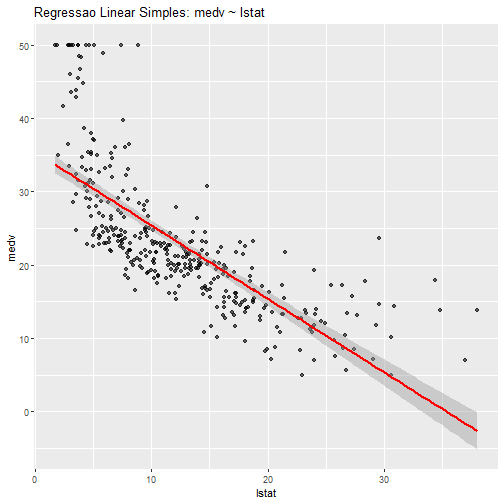
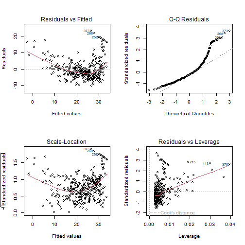
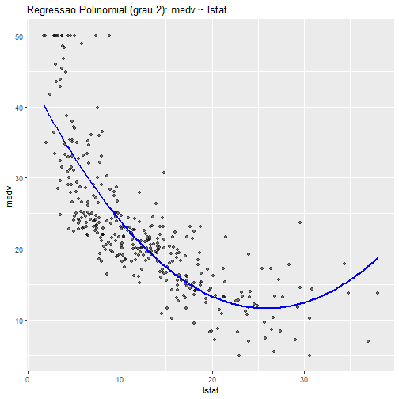
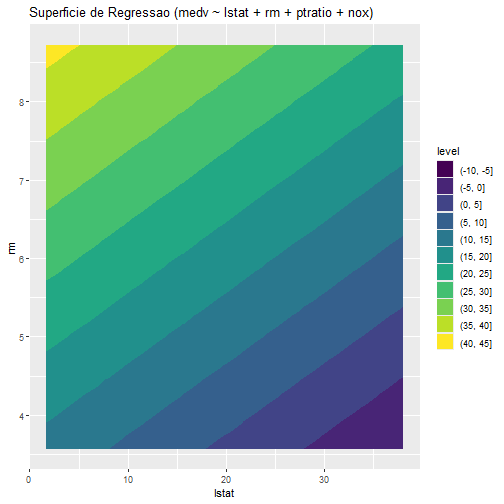

# Regressão - Fundamentos e Modelos

Exemplos alinhados aos slides de `4-Regressao.pdf`.  
Cada chunk indica o **slide** correspondente.

## Como ler este roteiro
Interprete os resultados em três ciclos:
1. ajuste do modelo;
2. diagnóstico/premissas;
3. comparação de desempenho em teste.
Esse ciclo ajuda a decidir quando aumentar complexidade.

## Configuração

Carregamos pacotes para três frentes: modelagem (`daltoolbox`), visualização (`ggplot2`) e manipulação de dados (`dplyr`), além do conjunto de dados `Boston` em `MASS`.  
Slides: 1–7.


``` r
# Slides 1–7: conceitos e taxonomia
library(daltoolbox)
library(ggplot2)
library(dplyr)
library(MASS)
```

## Conjunto de dados e divisao treino/teste

Usamos o `Boston Housing` para prever `medv` (valor mediano de imóveis).  
Neste ponto, a meta é entender estrutura de variáveis antes de modelar.


``` r
# Slides 10: conjunto de dados Boston Housing
data(Boston)
str(Boston)
```

```
## 'data.frame':	506 obs. of  14 variables:
##  $ crim   : num  0.00632 0.02731 0.02729 0.03237 0.06905 ...
##  $ zn     : num  18 0 0 0 0 0 12.5 12.5 12.5 12.5 ...
##  $ indus  : num  2.31 7.07 7.07 2.18 2.18 2.18 7.87 7.87 7.87 7.87 ...
##  $ chas   : int  0 0 0 0 0 0 0 0 0 0 ...
##  $ nox    : num  0.538 0.469 0.469 0.458 0.458 0.458 0.524 0.524 0.524 0.524 ...
##  $ rm     : num  6.58 6.42 7.18 7 7.15 ...
##  $ age    : num  65.2 78.9 61.1 45.8 54.2 58.7 66.6 96.1 100 85.9 ...
##  $ dis    : num  4.09 4.97 4.97 6.06 6.06 ...
##  $ rad    : int  1 2 2 3 3 3 5 5 5 5 ...
##  $ tax    : num  296 242 242 222 222 222 311 311 311 311 ...
##  $ ptratio: num  15.3 17.8 17.8 18.7 18.7 18.7 15.2 15.2 15.2 15.2 ...
##  $ black  : num  397 397 393 395 397 ...
##  $ lstat  : num  4.98 9.14 4.03 2.94 5.33 ...
##  $ medv   : num  24 21.6 34.7 33.4 36.2 28.7 22.9 27.1 16.5 18.9 ...
```

``` r
head(Boston)
```

```
##      crim zn indus chas   nox    rm  age    dis rad tax ptratio  black lstat medv
## 1 0.00632 18  2.31    0 0.538 6.575 65.2 4.0900   1 296    15.3 396.90  4.98 24.0
## 2 0.02731  0  7.07    0 0.469 6.421 78.9 4.9671   2 242    17.8 396.90  9.14 21.6
## 3 0.02729  0  7.07    0 0.469 7.185 61.1 4.9671   2 242    17.8 392.83  4.03 34.7
## 4 0.03237  0  2.18    0 0.458 6.998 45.8 6.0622   3 222    18.7 394.63  2.94 33.4
## 5 0.06905  0  2.18    0 0.458 7.147 54.2 6.0622   3 222    18.7 396.90  5.33 36.2
## 6 0.02985  0  2.18    0 0.458 6.430 58.7 6.0622   3 222    18.7 394.12  5.21 28.7
```

Com os dados inspecionados, definimos a divisão treino/teste e as métricas-base que serão reutilizadas em todo o roteiro.


``` r
# Slides 10: preparação treino/teste
set.seed(1)
split_random <- sample_random()
split_random <- train_test(split_random, Boston, perc = 0.7)
train <- split_random$train
test <- split_random$test

eval_reg <- function(model, y_true, y_pred, attribute = "medv") {
  # Alguns modelos (ex.: reg_lm) podem retornar NULL em evaluate(model, ...)
  eval <- evaluate(model, y_true, y_pred)
  if (is.null(eval) || is.null(eval$metrics)) {
    proxy <- regression(attribute)
    eval <- evaluate(proxy, as.vector(y_true), as.vector(y_pred))
  }
  eval
}
```

A avaliação será feita com `evaluate()` para manter o mesmo protocolo em todos os modelos do roteiro.  
Slides: 10.

## Regressão linear simples

Começamos com um modelo simples (`medv ~ lstat`) para criar a referência inicial de desempenho e interpretação.  
Slides: 8 e 11.


``` r
# Slides 8 e 11: regressão linear simples e ajuste
model_lm_simple <- reg_lm(formula = medv ~ lstat)
model_lm_simple <- fit(model_lm_simple, train)
summary(model_lm_simple$model)
```

```
## 
## Call:
## stats::lm(formula = obj$formula, data = data)
## 
## Residuals:
##     Min      1Q  Median      3Q     Max 
## -10.273  -4.237  -1.514   1.914  23.458 
## 
## Coefficients:
##             Estimate Std. Error t value Pr(>|t|)    
## (Intercept) 35.44531    0.69048   51.34   <2e-16 ***
## lstat       -1.00263    0.04819  -20.81   <2e-16 ***
## ---
## Signif. codes:  0 '***' 0.001 '**' 0.01 '*' 0.05 '.' 0.1 ' ' 1
## 
## Residual standard error: 6.412 on 352 degrees of freedom
## Multiple R-squared:  0.5515,	Adjusted R-squared:  0.5503 
## F-statistic: 432.9 on 1 and 352 DF,  p-value: < 2.2e-16
```

``` r
train_pred_simple <- predict(model_lm_simple, newdata = train)
eval_reg(model_lm_simple, train$medv, train_pred_simple, "medv")$metrics
```

```
##     mse     smape        R2
## 1 40.88 0.2213839 0.5515344
```

``` r
test_pred_simple <- predict(model_lm_simple, newdata = test)
eval_reg(model_lm_simple, test$medv, test_pred_simple, "medv")$metrics
```

```
##        mse     smape        R2
## 1 33.53909 0.2279417 0.5022216
```

O gráfico a seguir conecta o ajuste linear à nuvem de pontos, facilitando leitura de tendência e dispersão residual.  
Slides: 17.


``` r
# Slides 17: visualização do ajuste
ggplot(train, aes(x = lstat, y = medv)) +
  geom_point(alpha = 0.6) +
  geom_smooth(method = "lm", se = TRUE, color = "red") +
  labs(title = "Regressao Linear Simples: medv ~ lstat")
```



Na sequência, comparamos dois tipos de intervalo:
- `prediction`: incerteza para uma nova observação individual;
- `confidence`: incerteza para a média esperada.  
Slides: 16.


``` r
# Slides 16: intervalos de predição e confiança
pred_int <- predict(model_lm_simple$model, newdata = test, interval = "prediction")
head(pred_int)
```

```
##         fit       lwr      upr
## 5  30.10128 17.454987 42.74758
## 6  30.22160 17.574690 42.86851
## 7  22.98260 10.354375 35.61082
## 8  16.24491  3.600790 28.88903
## 9   5.43654 -7.299741 18.17282
## 10 18.30031  5.664436 30.93618
```

``` r
conf_int <- predict(model_lm_simple$model, newdata = test, interval = "confidence")
head(conf_int)
```

```
##         fit      lwr      upr
## 5  30.10128 29.14941 31.05316
## 6  30.22160 29.26162 31.18158
## 7  22.98260 22.31235 23.65284
## 8  16.24491 15.32240 17.16742
## 9   5.43654  3.65046  7.22262
## 10 18.30031 17.49877 19.10184
```

Os diagnósticos clássicos (`Residuals vs Fitted`, `QQ-plot`, `Scale-Location`, `Residuals vs Leverage`) ajudam a verificar premissas do modelo linear.  
Slides: 18.


``` r
# Slides 18: diagnóstico visual
par(mfrow = c(2, 2))
plot(model_lm_simple$model)
```



``` r
par(mfrow = c(1, 1))
```

## Regressão polinomial

Agora relaxamos a linearidade com termo quadrático para capturar curvatura entre `lstat` e `medv`.  
A comparação via ANOVA mostra se o ganho de complexidade é estatisticamente justificável.  
Slides: 21–26.


``` r
# Slides 21–26: regressão polinomial e overfitting
model_lm_poly2 <- reg_lm(formula = medv ~ poly(lstat, 2, raw = TRUE))
model_lm_poly2 <- fit(model_lm_poly2, train)
summary(model_lm_poly2$model)
```

```
## 
## Call:
## stats::lm(formula = obj$formula, data = data)
## 
## Residuals:
##      Min       1Q   Median       3Q      Max 
## -11.2327  -4.1001  -0.3772   2.4898  24.1548 
## 
## Coefficients:
##                              Estimate Std. Error t value Pr(>|t|)    
## (Intercept)                 44.506809   1.018352   43.70   <2e-16 ***
## poly(lstat, 2, raw = TRUE)1 -2.536197   0.145750  -17.40   <2e-16 ***
## poly(lstat, 2, raw = TRUE)2  0.048948   0.004458   10.98   <2e-16 ***
## ---
## Signif. codes:  0 '***' 0.001 '**' 0.01 '*' 0.05 '.' 0.1 ' ' 1
## 
## Residual standard error: 5.54 on 351 degrees of freedom
## Multiple R-squared:  0.6662,	Adjusted R-squared:  0.6643 
## F-statistic: 350.2 on 2 and 351 DF,  p-value: < 2.2e-16
```

``` r
anova(model_lm_simple$model, model_lm_poly2$model)
```

```
## Analysis of Variance Table
## 
## Model 1: medv ~ lstat
## Model 2: medv ~ poly(lstat, 2, raw = TRUE)
##   Res.Df   RSS Df Sum of Sq      F    Pr(>F)    
## 1    352 14472                                  
## 2    351 10772  1    3699.5 120.55 < 2.2e-16 ***
## ---
## Signif. codes:  0 '***' 0.001 '**' 0.01 '*' 0.05 '.' 0.1 ' ' 1
```

O gráfico abaixo permite inspeção visual direta da curvatura aprendida pelo modelo polinomial.  
Slide: 23.


``` r
# Slides 23: visualização da regressão polinomial
grid <- data.frame(lstat = seq(min(train$lstat), max(train$lstat), length.out = 200))
grid$pred <- predict(model_lm_poly2, newdata = grid)

ggplot(train, aes(x = lstat, y = medv)) +
  geom_point(alpha = 0.5) +
  geom_line(data = grid, aes(x = lstat, y = pred), color = "blue", linewidth = 1) +
  labs(title = "Regressao Polinomial (grau 2): medv ~ lstat")
```



## Regressão múltipla

Entramos em regressão múltipla para combinar variáveis explicativas e reduzir erro preditivo fora da amostra.  
Slides: 27–29.


``` r
# Slides 27–29: regressão múltipla e interpretação
model_lm_multi <- reg_lm(formula = medv ~ lstat + rm + ptratio)
model_lm_multi <- fit(model_lm_multi, train)
summary(model_lm_multi$model)
```

```
## 
## Call:
## stats::lm(formula = obj$formula, data = data)
## 
## Residuals:
##      Min       1Q   Median       3Q      Max 
## -12.1020  -3.2174  -0.6043   1.8613  29.2970 
## 
## Coefficients:
##             Estimate Std. Error t value Pr(>|t|)    
## (Intercept) 12.30766    4.68672   2.626  0.00902 ** 
## lstat       -0.52334    0.05159 -10.143  < 2e-16 ***
## rm           5.50996    0.50310  10.952  < 2e-16 ***
## ptratio     -0.95685    0.14051  -6.810 4.27e-11 ***
## ---
## Signif. codes:  0 '***' 0.001 '**' 0.01 '*' 0.05 '.' 0.1 ' ' 1
## 
## Residual standard error: 5.127 on 350 degrees of freedom
## Multiple R-squared:  0.7149,	Adjusted R-squared:  0.7125 
## F-statistic: 292.5 on 3 and 350 DF,  p-value: < 2.2e-16
```

``` r
train_pred_multi <- predict(model_lm_multi, newdata = train)
eval_reg(model_lm_multi, train$medv, train_pred_multi, "medv")$metrics
```

```
##        mse     smape        R2
## 1 25.98853 0.1865811 0.7148982
```

``` r
test_pred_multi <- predict(model_lm_multi, newdata = test)
eval_reg(model_lm_multi, test$medv, test_pred_multi, "medv")$metrics
```

```
##        mse     smape        R2
## 1 30.92844 0.2006984 0.5409681
```

A ANOVA entre modelos aninhados testa se incluir `nox` adiciona poder explicativo relevante.  
Slide: 30.


``` r
# Slides 30: ANOVA para regressão múltipla
model_lm_multi2 <- reg_lm(formula = medv ~ lstat + rm + ptratio + nox)
model_lm_multi2 <- fit(model_lm_multi2, train)
anova(model_lm_multi$model, model_lm_multi2$model)
```

```
## Analysis of Variance Table
## 
## Model 1: medv ~ lstat + rm + ptratio
## Model 2: medv ~ lstat + rm + ptratio + nox
##   Res.Df    RSS Df Sum of Sq      F Pr(>F)
## 1    350 9199.9                           
## 2    349 9187.1  1    12.813 0.4868 0.4858
```

Em seguida, calculamos VIF para monitorar multicolinearidade entre preditores, que pode inflar variâncias dos coeficientes.  
Slide: 31.


``` r
# Slides 31: multicolinearidade (VIF)
vif_calc <- function(model) {
  X <- model.matrix(model)[, -1, drop = FALSE]
  vifs <- numeric(ncol(X))
  names(vifs) <- colnames(X)
  for (j in seq_len(ncol(X))) {
    # Regride cada preditor nos demais para obter R^2_j
    y <- X[, j]
    x <- X[, -j, drop = FALSE]
    r2 <- summary(lm(y ~ x))$r.squared
    # VIF_j = 1 / (1 - R^2_j)
    vifs[j] <- 1 / (1 - r2)
  }
  vifs
}
vif_calc(model_lm_multi2$model)
```

```
##    lstat       rm  ptratio      nox 
## 2.436583 1.771009 1.241960 1.546373
```

Esta visualização transforma o modelo em superfície de resposta para facilitar interpretação conjunta de duas variáveis contínuas.  
Slide: 32.


``` r
# Slides 32: superfície de regressão múltipla
grid2 <- expand.grid(
  lstat = seq(min(train$lstat), max(train$lstat), length.out = 30),
  rm = seq(min(train$rm), max(train$rm), length.out = 30),
  ptratio = mean(train$ptratio),
  nox = mean(train$nox)
)
grid2$pred <- predict(model_lm_multi2, newdata = grid2)

ggplot(grid2, aes(x = lstat, y = rm, z = pred)) +
  geom_contour_filled() +
  labs(title = "Superficie de Regressao (medv ~ lstat + rm + ptratio + nox)")
```



Por fim, ajustamos um modelo com todos os preditores para ilustrar cenário de maior dimensionalidade e discutir risco de overfitting.  
Slide: 33.


``` r
# Slides 33: alta dimensionalidade
model_lm_full <- reg_lm(formula = medv ~ .)
model_lm_full <- fit(model_lm_full, train)
summary(model_lm_full$model)
```

```
## 
## Call:
## stats::lm(formula = obj$formula, data = data)
## 
## Residuals:
##      Min       1Q   Median       3Q      Max 
## -11.1732  -2.7272  -0.5408   1.6594  23.9450 
## 
## Coefficients:
##               Estimate Std. Error t value Pr(>|t|)    
## (Intercept)  28.209249   6.094508   4.629 5.24e-06 ***
## crim         -0.070644   0.042379  -1.667 0.096439 .  
## zn            0.036046   0.016006   2.252 0.024959 *  
## indus         0.030055   0.069986   0.429 0.667874    
## chas          3.419418   0.933343   3.664 0.000288 ***
## nox         -14.582615   4.374454  -3.334 0.000952 ***
## rm            4.856324   0.493995   9.831  < 2e-16 ***
## age          -0.014469   0.015251  -0.949 0.343431    
## dis          -1.411125   0.231606  -6.093 3.01e-09 ***
## rad           0.303706   0.075162   4.041 6.59e-05 ***
## tax          -0.013742   0.004219  -3.257 0.001238 ** 
## ptratio      -0.941851   0.154394  -6.100 2.88e-09 ***
## black         0.010698   0.003084   3.469 0.000590 ***
## lstat        -0.480384   0.061173  -7.853 5.37e-14 ***
## ---
## Signif. codes:  0 '***' 0.001 '**' 0.01 '*' 0.05 '.' 0.1 ' ' 1
## 
## Residual standard error: 4.593 on 340 degrees of freedom
## Multiple R-squared:  0.7778,	Adjusted R-squared:  0.7693 
## F-statistic: 91.52 on 13 and 340 DF,  p-value: < 2.2e-16
```

## Modelos supervisionados (DALToolbox)

Esta seção conecta a taxonomia de regressão dos slides com modelos não lineares/mais flexíveis, mantendo protocolo de treino e teste.  
Slides: 7, 19–20.


``` r
# Slides 19–20: extensões da regressão linear (modelos mais complexos)
# Complemento prático com DALToolbox
Boston_m <- as.matrix(Boston)
set.seed(1)
split_random_m <- sample_random()
split_random_m <- train_test(split_random_m, Boston_m)
boston_train <- split_random_m$train
boston_test <- split_random_m$test
```

Para leitura didática, em cada modelo observe principalmente:
1. diferença entre métricas de treino e teste (generalização);
2. relação entre complexidade do modelo e erro preditivo.


``` r
# Slides 7: taxonomia (árvore de regressão)
model_dtree <- reg_dtree("medv")
model_dtree <- fit(model_dtree, boston_train)
train_pred <- predict(model_dtree, boston_train)
eval_reg(model_dtree, boston_train[, "medv"], train_pred, "medv")$metrics
```

```
##        mse     smape        R2
## 1 12.68065 0.1345098 0.8591168
```

``` r
test_pred <- predict(model_dtree, boston_test)
eval_reg(model_dtree, boston_test[, "medv"], test_pred, "medv")$metrics
```

```
##        mse     smape        R2
## 1 29.38142 0.1642396 0.5117372
```

No kNN, o parâmetro `k` controla o equilíbrio entre variância e viés.


``` r
# Slides 7: taxonomia (kNN para regressão)
model_knn <- reg_knn("medv", k = 5)
model_knn <- fit(model_knn, boston_train)
train_pred <- predict(model_knn, boston_train)
eval_reg(model_knn, boston_train[, "medv"], train_pred, "medv")$metrics
```

```
##        mse    smape        R2
## 1 27.02782 0.155995 0.6997184
```

``` r
test_pred <- predict(model_knn, boston_test)
eval_reg(model_knn, boston_test[, "medv"], test_pred, "medv")$metrics
```

```
##       mse     smape       R2
## 1 26.9483 0.1791238 0.552171
```

A MLP introduz não linearidade; compare com kNN e árvore para avaliar ganho real em teste.


``` r
# Slides 7: taxonomia (MLP para regressão)
model_mlp <- reg_mlp("medv", size = 5, decay = 0.54)
model_mlp <- fit(model_mlp, boston_train)
train_pred <- predict(model_mlp, boston_train)
eval_reg(model_mlp, boston_train[, "medv"], train_pred, "medv")$metrics
```

```
##        mse      smape        R2
## 1 7.815809 0.09907171 0.9131656
```

``` r
test_pred <- predict(model_mlp, boston_test)
eval_reg(model_mlp, boston_test[, "medv"], test_pred, "medv")$metrics
```

```
##        mse     smape        R2
## 1 17.59761 0.1396753 0.7075616
```

Random Forest tende a reduzir variância de árvores individuais; aqui observamos estabilidade preditiva.


``` r
# Slides 7: taxonomia (Random Forest para regressão)
model_rf <- reg_rf("medv", mtry = 7, ntree = 30)
model_rf <- fit(model_rf, boston_train)
train_pred <- predict(model_rf, boston_train)
eval_reg(model_rf, boston_train[, "medv"], train_pred, "medv")$metrics
```

```
##        mse      smape        R2
## 1 1.247833 0.03846161 0.9861365
```

``` r
test_pred <- predict(model_rf, boston_test)
eval_reg(model_rf, boston_test[, "medv"], test_pred, "medv")$metrics
```

```
##       mse     smape       R2
## 1 12.6109 0.1170046 0.790431
```

No SVR, `cost` e `epsilon` regulam margem e tolerância ao erro; observe sensibilidade das métricas.


``` r
# Slides 7: taxonomia (SVR)
model_svm <- reg_svm("medv", epsilon = 0.2, cost = 40.000)
model_svm <- fit(model_svm, boston_train)
train_pred <- predict(model_svm, boston_train)
eval_reg(model_svm, boston_train[, "medv"], train_pred, "medv")$metrics
```

```
##        mse     smape        R2
## 1 2.855767 0.0700268 0.9682722
```

``` r
test_pred <- predict(model_svm, boston_test)
eval_reg(model_svm, boston_test[, "medv"], test_pred, "medv")$metrics
```

```
##        mse     smape        R2
## 1 14.65598 0.1363336 0.7564457
```

Por fim, fazemos tuning para testar se a configuração automática supera o SVR definido manualmente.


``` r
# Slides 19: extensões e ajuste de modelos (tuning)
tune <- reg_tune(
  reg_svm("medv"),
  ranges = list(seq(0, 1, 0.2), cost = seq(20, 100, 20), kernel = c("radial"))
)
model_tuned <- fit(tune, boston_train)
train_pred <- predict(model_tuned, boston_train)
eval_reg(model_tuned, boston_train[, "medv"], train_pred, "medv")$metrics
```

```
##        mse     smape       R2
## 1 1.468661 0.0461686 0.983683
```

``` r
test_pred <- predict(model_tuned, boston_test)
eval_reg(model_tuned, boston_test[, "medv"], test_pred, "medv")$metrics
```

```
##        mse    smape        R2
## 1 16.50897 0.141226 0.7256526
```

Resumo pedagógico: o roteiro progride de um modelo linear simples para modelos mais expressivos, sempre validando ganho por desempenho e interpretabilidade.  
Isso ajuda a justificar tecnicamente quando vale sair de regressão linear clássica para métodos de maior complexidade.

## Referências
- Montgomery, D. C., Peck, E. A., Vining, G. (2012). *Introduction to Linear Regression Analysis*.
- James, G., Witten, D., Hastie, T., Tibshirani, R. (2021). *An Introduction to Statistical Learning*.
- Draper, N. R., Smith, H. (1998). *Applied Regression Analysis*.
- Breiman, L. (2001). Random Forests. *Machine Learning*.
- Drucker, H. et al. (1997). Support Vector Regression Machines.


